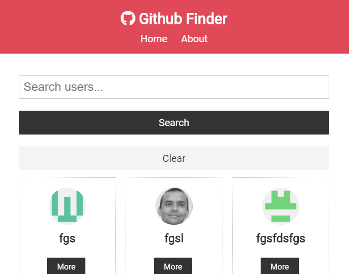

# Github Finder

Use this app to find Github users by name.
View info about user, including job status, location, and repos.

Coded in course by Brad Traversy.

## Techstack:

 - React
 - Hooks & Context
 - Axios
